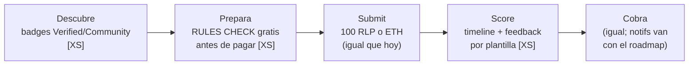
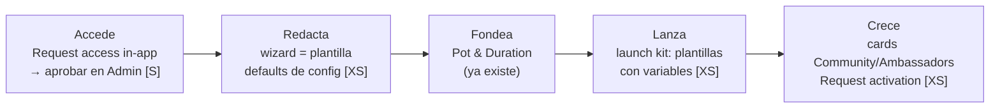

# app.rally.fun — Creator Flow & Brand Flow (v4)

**Dos journeys, fixes mínimos.** Cada fix etiquetado con coste de desarrollo:
`XS` = frontend/config/plantillas, sin backend nuevo · `S` = backend pequeño (un endpoint, un flag) · `FASE 2` = recortado del MVP.
Protocolo intacto: pot, periods, misiones, evaluación, curvas, targeting, deposit y coste de submission (100 RLP o ETH ~$1.20) no cambian.
Diseños: [`app-rally-designs.html`](./app-rally-designs.html).

**Regla de recorte:** si un fix necesita backend nuevo o AI → MVP sin ello + fase 2. Si un proceso interno ya funciona a mano (activar Communities, crear orgs) → el MVP solo lo hace *visible y pedible* desde el producto, no lo automatiza.

---

## 1. Creator Flow

| Etapa | Fricción hoy | Fix | Coste |
|---|---|---|---|
| Descubrir | No distingues partner de comunidad; elegibilidad opaca | Badge ✔ Verified / Community en la card (un flag + un chip) | XS |
| Preparar | 10+ reglas en prosa; pagas 100 RLP *antes* de saber si cumples | **Rules check antes de pagar**: regex en el cliente sobre el texto del tweet (quote correcto, menciones, em dashes, no empezar con mención). Orientativo — la AI Evaluation decide | XS · aviso de originalidad con AI: FASE 2 |
| Submit | Tras pagar, silencio (~4 min) | Timeline Submitted → In queue → Scored (estados que ya existen, solo se pintan) | XS |
| Score | Los gauges dicen el qué, no el cómo | Línea de feedback **por plantilla**: gate más bajo → consejo fijo. Sin LLM. El botón "Ask Wingston" ya existe | XS |
| Cobrar | Ya funciona | Sin cambios. Notificaciones de cierre → feature Notifications ya en roadmap, no se duplica | — |

**Psicología del fix clave (rules check):** loss aversion — el miedo a perder 100 RLP frena más que el coste. Quitar el riesgo percibido = más primeras submissions = north star. Mensaje en pantalla: "FREE · BEFORE YOU PAY" + "advisory — final scoring happens in AI Evaluation".

---

## 2. Brand Flow

**Hoy (Partner Campaign Guide):** ~7 contactos con el equipo, 3 Google Docs y 2 Looms.

| Etapa | Fricción hoy | Fix | Coste |
|---|---|---|---|
| Acceso | Emails → org manual → días de espera | Formulario "Request access" (nombre org + emails) → aprobación en 1 click en el Admin existente | S · self-serve completo: FASE 2 |
| Redactar | Google Doc plantilla + review por TG + 2 Looms | El wizard ES la plantilla (defaults = presets de config). "Request Rally review" = botón que notifica al equipo con el link del draft. "See participant view" (ya existe) sustituye a los Looms | XS |
| Fondear | Pool decidido en conversaciones | Nada nuevo — Pot & Duration ya lo resuelve (USDC / token propio / capa RLP). Solo resumen de deposit visible | XS |
| Lanzar | Announcements ad hoc por Telegram | Launch kit: plantillas fijas con variables del draft (título, pot, link) — sin AI. Fecha = start date existente. "Request amplification" = notificación al equipo | XS |
| Crecer | Community (>$2,000) y Ambassadors se activan "avisando al equipo", invisibles | Dos cards estáticas con elegibilidad calculada del pot + "Request activation" (notifica; la activación sigue interna como hoy) | XS |

---

## 3. Plan de implementación (MVP en orden)

| # | Fix | Coste | Qué toca |
|---|---|---|---|
| 1 | Rules check antes de pagar | XS | Solo frontend (regex + reglas ya estructuradas). Mueve el north star |
| 2 | Timeline + feedback por plantilla | XS | Solo frontend (datos que ya llegan) |
| 3 | Checklist de brand + Request access | S | Formulario + aprobación en Admin + página con estado derivado |
| 4 | Launch kit | XS | Frontend + plantillas de copy |
| 5 | Cards Community/Ambassadors | XS | Dos componentes + notificación |
| 6 | Badge Verified/Community | XS | Flag por proyecto + chip |

### Recortado (y por qué)
- Pre-check con AI → fase 2 (el 80% del valor es mecánico)
- Org self-serve completa → fase 2 (el request in-app ya mata los emails)
- Announcements con AI → innecesario (plantillas con variables)
- Notificaciones nuevas → van con el feature Notifications del roadmap
- Automatizar activación de Communities/Ambassadors → no; el proceso interno funciona, solo faltaba hacerlo visible

### Medición
- **Creator:** conversión visita→primera submission · submissions/usuario/semana · % descalificadas (debe caer)
- **Brand:** time-to-first-campaign (días → 1 sesión) · % campañas sin intervención del equipo · requests desde las cards
