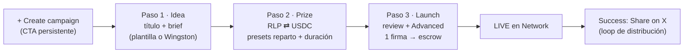
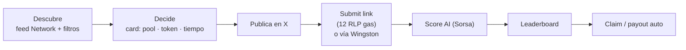
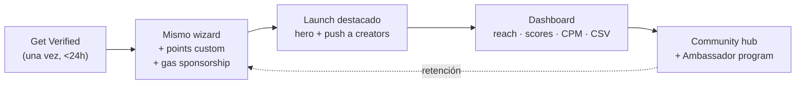

# app.rally.fun — Network & Campaign Creation

**Propuesta de flows (Creator POV / Brand POV) + creación de campañas permissionless.**
Complementa "2026.07.10 Rally.fun Updated flows" (Pablo) — este doc cubre app.rally.fun.
Los diseños de las pantallas están en [`app-rally-designs.html`](./app-rally-designs.html).

---

## 1. El modelo: Network

Todo campaign discovery vive en una sección nueva llamada **Network**, con dos carriles:

| | Network Campaigns (permissionless) | Verified Campaigns (brands/partners) |
|---|---|---|
| Quién crea | Cualquier wallet conectada | Proyectos verificados (badge) |
| Prize pool | RLP (mín. 5.000) o USDC (mín. $50), en escrow | USDC / token / points (mín. $2.000 eq.) |
| Lanzamiento | Wizard 3 pasos, 1 firma, instantáneo | Mismo wizard + verificación única (<24h) |
| Placement | Grid del feed | Hero destacado + push + Boost |
| Extras | Leaderboard, AI eval, payout auto | Analytics/CSV, community hub, ambassadors, gas sponsorship, invoice |
| Fee | 3% del pool | 3% del pool + pricing premium |

**Racional:** Network resuelve el cold-start de supply (siempre hay campañas live) y empuja el north star (submissions × gas). Verified protege el pricing de BD: la verificación es el paquete de distribución + datos que un brand paga, no un peaje.

---

## 2. Creator POV — lanzar una Network Campaign

### Wizard — una decisión por paso

**Paso 1 · La idea** — "What should creators post?"
- Título (60 chars) + brief (textarea con ejemplo)
- Botón "Let Wingston write it from your title"
- Tipo de contenido: Tweet / Thread / Clip
- Plantillas 1-click (reutilizan el calendario de campañas internas: The Cringe Archive, Your Toxic Trait, The 404…)
- Draft autosave

**Paso 2 · El premio** — "What's the prize?"
- Toggle RLP ⇄ USDC, mínimos visibles junto al campo
- Presets de pool (5k / 10k / 25k / 50k RLP)
- Reparto como 3 presets visuales (nada de curvas técnicas):
  - **Top 10 · curve** — el mejor post se lleva el mayor corte
  - **Equal split** — todos los ganadores igual
  - **Score-weighted** — proporcional al score AI
- Duración: 24h / 3d / 7d / Custom
- **Resumen en vivo:** pool + fee 3% = total a bloquear; copy de escrow ("si nadie participa, refund total"; "creators pagan su gas, 12 RLP/submission")

**Paso 3 · Lanzar**
- Review compacto + **Advanced colapsado** (elegibilidad: min Sorsa / community-only / idioma; mods + ventana 24h de descalificación; schedule)
- **1 firma**: approve + fund escrow + activar en una tx
- Success screen: link `rally.fun/c/...` + "Share on X" pre-rellenado + "Track submissions"

**Objetivo medible: de idea a live en < 2 minutos.**

---

## 3. Creator POV — participar (sin cambios estructurales)

La card de campaña se decide con **3 datos siempre en la misma posición**: pool, token (color-coded: ámbar RLP, azul USDC, violeta points) y tiempo restante. El creador de la campaña es visible (avatar + Sorsa score) como señal de confianza.

---

## 4. Brand POV — Verified Campaigns

### Get Verified (checklist, una sola vez)
1. **Project profile** — logo, banner, descripción, links *(ya resuelto en onboarding)*
2. **Verify X account** — post de prueba desde @proyecto *(ya resuelto)*
3. **Business details** — KYB-lite, 2 min
4. **Fund first campaign** — desde $2.000 USDC eq., por wallet **o invoice**

### Qué desbloquea
- Badge VERIFIED + hero placement en Network + push a creators afines
- Rewards en points/token propio (no solo RLP/USDC)
- Analytics de campaña (reach, scores, CPM, lista de creators, CSV) — en lenguaje de marketer
- Community hub auto-creada (persiste tras la campaña) + Ambassador programs
- Sponsor del gas de los creators ("partner pays for gas")
- Pago por invoice (equipos de finanzas sin wallet)

---

## 5. Confianza y anti-spam

| Mecanismo | Detalle |
|---|---|
| Escrow on-chain | El pool sale de la wallet al lanzar. Listada = pagada. Refund si expira sin submissions |
| Mínimos de pool | 5.000 RLP / $50 USDC — el spam cuesta dinero; ajustable como config |
| Rate limit | Máx. 3 campañas activas por wallet no verificada |
| Reputación | Sorsa score del creador visible en la card; opcional: min. historial para crear |
| Reports | Denounce → cola de revisión; reutiliza mods + ventana 24h existentes |
| Filtro de contenido | Scan automático del brief (scam, phishing, impersonación) |

---

## 6. Métricas

- **Time-to-launch** (mediana) — objetivo < 2 min
- **Completion rate del wizard** por paso (vigilar drop en paso 2, funding)
- **Campañas/semana creadas fuera del equipo** y % del total
- **Submissions por campaña** Network vs Verified → north star (submissions × gas)
- **Conversión Get Verified** (perfil → verificado → primera campaña)

## 7. Next steps

**Diseño (Pablo):** tokens de color vs design system real; estados vacíos de Network; wizard mobile (1 col, coste como bottom-sheet); microcopy EN + KO.

**Dev:** factory permissionless + escrow multi-token (RLP/USDC) con fee 3% y refund; presets de distribución sobre el cambio de contrato de pagos fijos ya planificado; flag `verified` + cola admin; mínimos/rate-limits como config; draft autosave; Wingston para briefs; share-intent X.

**Encaje roadmap:** Permissionless Campaigns está en planning para la semana del 28 de julio (3–6 días). MVP = Network feed + wizard + escrow. Analytics, Boost y facturación → iteración siguiente.
