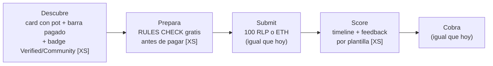
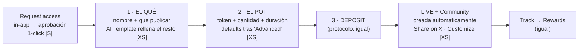

# app.rally.fun — Creator Flow & Brand Flow (v6)

**Dos journeys, fixes mínimos, cuantos menos pasos mejor.** Coste de dev: `XS` = frontend/config, sin backend nuevo · `S` = backend pequeño · `FASE 2` = recortado del MVP.
Protocolo intacto: pot, periods, misiones, evaluación, curvas, targeting, deposit y coste de submission (100 RLP o ETH ~$1.20) no cambian.
Datos clave del producto: **la Community se crea automáticamente al crear campaña** y **ser miembro es automático** (ganas puntos → estás dentro).
Diseños: [`app-rally-designs.html`](./app-rally-designs.html) · Doc formato "Updated flows": [`rally-updated-flows.html`](./rally-updated-flows.html).

---

## 1. Creator Flow

| Etapa | Fricción hoy | Fix | Coste |
|---|---|---|---|
| Descubrir | Las campañas no se distinguen; elegibilidad opaca | Card con pot por periodo + **barra de distribuido** (dato del Briefing) + badge ✔ Verified / Community | XS |
| Preparar | 10+ reglas en prosa; pagas 100 RLP *antes* de saber si cumples | **Rules check antes de pagar**: regex en cliente. Orientativo — la AI Evaluation decide | XS · AI: FASE 2 |
| Submit | Tras pagar, silencio (~4 min) | Timeline Submitted → In queue → Scored (estados existentes) | XS |
| Score | Los gauges dicen el qué, no el cómo | Línea de feedback por plantilla (gate más bajo → consejo fijo). Sin LLM | XS |
| Cobrar | Ya funciona | Sin cambios | — |

---

## 2. Brand Flow — crear campaña en 3 pantallas

**Hoy:** ~7 contactos con el equipo, 3 Google Docs y 2 Looms (Partner Campaign Guide).
**Propuesta:** request de acceso in-app + el formulario de crear campaña reagrupado en **3 pantallas**. Los 6 pasos actuales de Campaign Management (Basic · Pot & Duration · Missions · Evaluation · Targeting · Confirm & Deposit) no se eliminan — se reagrupan; mismos campos, misma API.

1. **El qué** — nombre + "what should creators post?" (Basic + Missions fundidos). AI Template rellena descripción, reglas y knowledge base. Resto bajo "Advanced ▾".
2. **El pot** — token (USDC / token del proyecto / RLP), cantidad, duración. Evaluation/Targeting = "✓ Rally defaults" tras "Advanced ▾", editables. Resumen del deposit visible.
3. **Deposit & launch** — el deposit del protocolo. Live inmediatamente.

**Success:** live + "Your Community was created automatically ✓" con Customize opcional + Copy link / Share on X.

---

## 3. Communities & Ambassadors — cerrar los dos caminos abiertos

La base ya está viva (Community auto-creada, membresía automática, página con Overview/Campaigns/Ambassadors/Members/Posts). Regla: **los datos ya existen (Sorsa, followers, historial) → cero formularios**.

### Creator → Ambassador (4 pasos, solo 1 nuevo)
1. Participa en campañas del proyecto — IGUAL
2. Miembro automático de la Community — IGUAL (+ toast: "You're now a member of GenLayer's community" la primera vez que ganas puntos)
3. **Apply = 1 click** — la solicitud es tu track record pre-rellenado (Sorsa, followers, campañas, top-10s) + nota opcional — NUEVO (XS)
4. Selected → badge en perfil + rewards mensuales + campañas "Ambassadors only" — ESTADOS (XS)

### Project → Ambassador Program (3 pasos)
1. **Open applications** — 3 campos: plazas · reward mensual (ej. 12,000 RLP) · fecha límite. Desde la pestaña Ambassadors de su Community — NUEVO (XS)
2. **Review & select** — applicants llegan rankeados por Sorsa/followers/historial → checkboxes → Confirm — NUEVO (XS)
3. **Run** — pagos mensuales gestionados por Rally + campañas con participation requirement "Ambassadors" — **ya existe** en Targeting

### Communities: dos retoques de copy, cero pantallas nuevas
- **Contar el join automático** en la card y en el estado no-miembro: "Earn points in any of its campaigns to join" + CTA a campañas activas.
- **Toast de entrada** la primera vez que ganas puntos con un proyecto.

---

## 4. Plan de implementación (MVP en orden)

| # | Fix | Coste | Qué toca |
|---|---|---|---|
| 1 | Rules check antes de pagar | XS | Solo frontend. Mueve el north star |
| 2 | Timeline + feedback por plantilla | XS | Solo frontend |
| 3 | Request access in-app | S | Formulario + aprobación en Admin |
| 4 | Crear campaña en 3 pantallas | XS | Reagrupar pasos existentes; defaults tras "Advanced" |
| 5 | Success (live + Community automática + share) | XS | Solo frontend |
| 6 | Apply ambassador 1-click + Open applications (3 campos) | S | Estados applied/selected + lista rankeada con datos existentes |
| 7 | Card de Network: barra de pagado + badge | XS | Datos existentes + un chip |

### Recortado
Launch kit (el Share on X cubre el caso) · cards de "activación" de Community (se crea sola) · pre-check con AI (fase 2) · org self-serve completa (fase 2) · notificaciones nuevas (feature Notifications del roadmap) · formularios de solicitud de ambassador (los datos ya existen).

### Medición
- **Creator:** conversión visita→primera submission · % descalificadas (debe caer) · applies por programa abierto.
- **Brand:** time-to-first-campaign (días → 1 sesión) · % campañas sin intervención del equipo · programas de ambassadors abiertos/mes.
