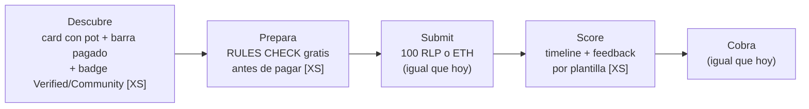
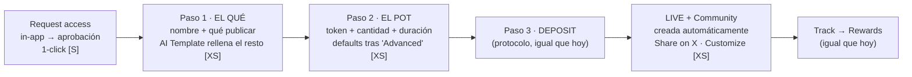

# app.rally.fun — Creator Flow & Brand Flow (v5)

**Dos journeys, fixes mínimos.** Coste de dev: `XS` = frontend/config, sin backend nuevo · `S` = backend pequeño · `FASE 2` = recortado del MVP.
Protocolo intacto: pot, periods, misiones, evaluación, curvas, targeting, deposit y coste de submission (100 RLP o ETH ~$1.20) no cambian.
**Dato clave del producto: al crear una campaña, la Community del proyecto se crea automáticamente** — no es un paso del flow, solo hay que contarlo en el success.
Diseños: [`app-rally-designs.html`](./app-rally-designs.html) · Doc formato "Updated flows": [`rally-updated-flows.html`](./rally-updated-flows.html).

---

## 1. Creator Flow

| Etapa | Fricción hoy | Fix | Coste |
|---|---|---|---|
| Descubrir | Las campañas no se distinguen; elegibilidad opaca | Card con pot por periodo + **barra de distribuido** (dato del Briefing: 500/1000 USDC) + badge ✔ Verified / Community | XS |
| Preparar | 10+ reglas en prosa; pagas 100 RLP *antes* de saber si cumples | **Rules check antes de pagar**: regex en cliente (quote, menciones, em dashes, no empezar con mención). Orientativo — la AI Evaluation decide | XS · originalidad con AI: FASE 2 |
| Submit | Tras pagar, silencio (~4 min) | Timeline Submitted → In queue → Scored (estados existentes, solo se pintan) | XS |
| Score | Los gauges dicen el qué, no el cómo | Línea de feedback por plantilla: gate más bajo → consejo fijo. Sin LLM | XS |
| Cobrar | Ya funciona | Sin cambios | — |

---

## 2. Brand Flow — crear campaña en 3 pasos

**Hoy (Partner Campaign Guide):** ~7 contactos con el equipo, 3 Google Docs y 2 Looms.
**Propuesta:** request de acceso in-app y un wizard de **3 pantallas**. De la pantalla 2 a la 5 es una sola sesión.

**Cómo se simplifica el wizard sin tocar nada:** los 6 pasos actuales (Basic details · Pot & Duration · Missions · Evaluation · Targeting · Confirm & Deposit) se reagrupan en 3 pantallas:

1. **El qué** — nombre + "what should creators post?" (Basic + Missions fundidos: son los mismos campos). AI Template (ya existe) rellena descripción, reglas y knowledge base. Knowledge base / style / misiones extra bajo "Advanced ▾".
2. **El pot** — token (USDC / token del proyecto / RLP; opcional capa de Rally Points), cantidad, duración. Evaluation y Targeting **no desaparecen**: quedan con los defaults de Rally detrás de "Advanced ▾ (✓ Rally defaults)", editables. Resumen del deposit visible.
3. **Deposit & launch** — el deposit del protocolo, sin cambios.

**Success:** campaña live + banner "Your Community was created automatically ✓" con botón Customize (banner, descripción, links) + Copy link / Share on X. Cero pasos extra: solo se cuenta lo que ya pasa solo.

| Etapa | Fricción hoy | Fix | Coste |
|---|---|---|---|
| Acceso | Emails → org manual → días | Formulario "Request access" → aprobación 1-click en el Admin existente | S |
| Redactar | Google Doc plantilla + review por TG + 2 Looms | Wizard de 3 pantallas; "Request Rally review" opcional; "See participant view" (ya existe) sustituye los Looms | XS |
| Fondear | Pool en conversaciones | Paso 2 del wizard con resumen de deposit | XS |
| Lanzar | Al crear no pasa nada visible; nadie sabe que la Community ya existe | Success screen: live + Community automática + Share on X | XS |
| Medir | Ya funciona | Leaderboard/stats por periodo, sin cambios | — |

---

## 3. Plan de implementación (MVP en orden)

| # | Fix | Coste | Qué toca |
|---|---|---|---|
| 1 | Rules check antes de pagar | XS | Solo frontend. Mueve el north star |
| 2 | Timeline + feedback por plantilla | XS | Solo frontend |
| 3 | Request access in-app | S | Formulario + aprobación en Admin |
| 4 | Wizard en 3 pantallas | XS | Reagrupar pasos existentes; defaults tras "Advanced". Mismos campos, misma API |
| 5 | Success (live + Community automática + share) | XS | Solo frontend |
| 6 | Card de Network: barra de pagado + badge | XS | Datos existentes + un chip |

### Recortado (y por qué)
- **Launch kit / announcement pack** — añadía un concepto nuevo; el Share on X del success cubre el caso.
- **Cards de "activación" de Community** — la Community se crea sola; no hay nada que activar.
- Pre-check con AI → fase 2 · Org self-serve completa → fase 2 · Notificaciones nuevas → feature Notifications del roadmap.

### Medición
- **Creator:** conversión visita→primera submission · submissions/usuario/semana · % descalificadas (debe caer).
- **Brand:** time-to-first-campaign (días → 1 sesión) · % campañas lanzadas sin intervención del equipo.
