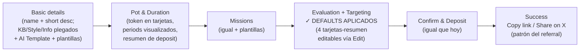

# app.rally.fun — Network & Campaign Creation (v2)

**Propuesta de UX para campañas permissionless, construida sobre el producto actual.**
Regla nº 1: **el protocolo no se toca** — pot, periods, misiones, evaluación (core gates / quality / engagement, curvas Balanced/Default/Extreme), targeting y deposit funcionan exactamente igual. Cambia la capa de presentación y quién puede acceder al wizard.
Los diseños están en [`app-rally-designs.html`](./app-rally-designs.html).

---

## 1. Qué cambia y qué no

| Capa | Se queda igual (protocolo/lógica) | Cambia (solo UI) |
|---|---|---|
| Creación | Los 6 pasos y todos sus campos: Basic details · Pot & Duration · Missions · Evaluation · Targeting on X · Confirm & Deposit | Evaluation y Targeting llegan pre-rellenos con los defaults actuales (curva Default, weights Balanced, Everyone), editables vía "Edit" |
| Economía | Deposit en Confirm & Deposit; submission = 100 RLP o ETH (~$1.20); periods y rewards per period | Nada — solo se muestra el resumen del deposit en cada paso |
| Evaluación | Core gates, quality/engagement metrics, curvas, external multiplier | Nada — los sliders quedan detrás de "Edit" |
| Quién crea | — | "Create campaign" visible para cualquier usuario conectado (Community) y proyectos con badge (Verified) |
| Discovery | Explore Campaigns: cards con banner, pot, ends-in, network chip | La sección se llama **Network** + filtro y badge Verified / Community |

> Los mínimos de pot y límites anti-spam de Community son decisiones de config del equipo — este doc **no fija cifras**. Los mockups usan solo valores reales del producto (500 USDC, 40K/75K RLP, 100 RLP por submission).

---

## 2. Sección Network

El Explore Campaigns actual, renombrado **Network**, con tres añadidos mínimos:

1. Botón **+ Create campaign** en la cabecera (estilo botón azul actual), visible para todos.
2. Chips de filtro **All / ✔ Verified / Community** debajo de los filtros existentes (que no se mueven).
3. Badge de carril en cada card: **✔ VERIFIED** (azul, junto al check del handle) o **COMMUNITY** (ámbar), al lado del chip de network lavanda que ya existe.

---

## 3. Crear campaña — el mismo wizard de 6 pasos, con defaults delante

La fricción actual no son los pasos: es que Evaluation y Targeting exigen entender sliders y gates para continuar. Propuesta:

**Basic details** — obligatorio solo name + short description. Knowledge Base, Campaign Style y Additional Information siguen ahí, plegados en "Optional details". El **AI Template** (ya existe) se hace protagonista; plantillas 1-click reutilizando las campañas internas semanales (vía el Import existente).

**Pot & Duration** — mismos parámetros (network, token, total, periods, period duration, fechas). Token como tarjetas con balance visible; periods dibujados como las barras del Briefing; resumen "You deposit / rewards per period" fijo a la derecha; se muestra el coste del participante (100 RLP / ETH ~$1.20) como contexto.

**Evaluation + Targeting con defaults** — 4 tarjetas-resumen editables:
- Distribution curve · **Default** (Balanced/Default/Extreme intactas)
- Scoring weights · **Balanced** (core gates 1.0; sliders detrás de Edit)
- Participation · **Everyone** (unlimited; whitelist/ambassadors/Sorsa gate/followers en Edit)
- Moderation · **Rally moderator** (disqualification on; añadir wallets en Edit)

Cero opciones eliminadas. Prueba social en el Pro Tip: "los mismos settings que Internet Court Is Here".

**Confirm & Deposit** — sin cambios funcionales. Se añade el estado de éxito: link de la campaña + **Copy link / Share on X** (mismo patrón que el bloque de referral).

---

## 4. Verified — rápido, sin papeleo

Dos pasos, nada de datos de empresa:

1. **Conectar la cuenta de X del proyecto**
2. **Request verification** → el equipo de Rally revisa y aprueba

Desbloquea: badge ✔ en campañas y perfil, carril Verified en Network (+ elegible para destacados), community hub persistente, y línea directa con el equipo para setups custom (points systems, campañas grandes — que siguen siendo el proceso de BD actual, fuera del producto).

---

## 5. Flows

**Creator/comunidad:** + Create campaign → pasos 1–3 (con plantillas/AI) → 4–5 en defaults → Confirm & Deposit → Success/Share on X.

**Brand:** Verified badge (una vez) → mismo wizard → carril Verified → leaderboard/stats existentes → community hub.

**Participante (sin cambios):** Network → mission/rules → submit tweet URL (100 RLP o ETH) → AI Evaluation → leaderboard → rewards por periodo.

---

## 6. Next steps

- **Producto:** mínimos de pot y límites anti-spam de Community (config, no protocolo) + criterio de aprobación Verified.
- **Diseño (Pablo):** badges definitivos sobre el design system; estados vacíos del filtro Community; wizard mobile.
- **Dev:** exponer el wizard fuera de Admin con permisos por rol; presets default de Evaluation/Targeting; plantillas vía Import; success con share-intent; flag `verified` + cola de aprobación.
- **Medición:** time-to-launch, completion por paso, campañas creadas fuera del equipo/semana, submissions Community vs Verified.

**Encaje roadmap:** Permissionless Campaigns, semana del 28 de julio (3–6 días). Este scope = permisos + defaults + filtro/badges + success screen.
