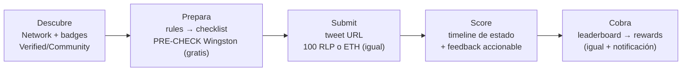
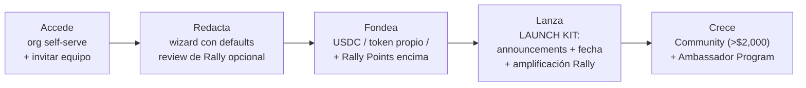

# app.rally.fun — Creator Flow & Brand Flow (v3)

**Dos journeys de punta a punta: fricción actual → fix (solo UI) → principio de psicología.**
Protocolo intacto: pot, periods, misiones, evaluación (gates/curvas), targeting, deposit y coste de submission (100 RLP o ETH ~$1.20) no cambian.
Diseños: [`app-rally-designs.html`](./app-rally-designs.html). El detalle del wizard de 6 pasos con defaults está en la v2 (historial de git).

---

## 1. Creator Flow

| Etapa | Fricción hoy | Fix (solo UI) | Psicología |
|---|---|---|---|
| Descubrir | Todas las campañas parecen iguales; elegibilidad opaca | Badge ✔ Verified / Community en la card; filtro "Eligible" elevado a chip | **Fluency** — decisión en 3 datos |
| Preparar | 10+ reglas en prosa; pagas 100 RLP *antes* de saber si cumples | **Pre-check gratuito de Wingston**: reglas → checklist verificada antes de pagar (orientativo; la AI Evaluation decide) | **Loss aversion** — el miedo a perder 100 RLP frena más que el coste. Quitarlo = más submissions (north star) |
| Submit | Tras pagar, silencio (~4 min de cola) | Timeline Submitted → In queue → Scored + notify me | **Goal gradient** — progreso visible retiene |
| Score | Los gauges dicen el qué, no el cómo mejorar | Línea de Wingston bajo los gauges: qué gate falló y cómo subir | **Attribution / peak-end** — el score pasa de veredicto a coaching |
| Cobrar | Ya funciona (projected rewards) | Solo notificación al cierre del periodo | **Peak-end** — cerrar el ciclo alimenta el hábito |

**Momento clave: el pre-check.** Las reglas ya son verificables (quote correcto, menciones, sin em dashes, no empezar con mención, originalidad). Wingston las comprueba gratis dentro del paso 2 actual (el stepper Read the rules / Submit / AI Evaluation no cambia). Mensaje en pantalla: "FREE · BEFORE YOU PAY" + "advisory — final scoring happens in AI Evaluation".

---

## 2. Brand Flow

**Hoy (Partner Campaign Guide):** ~7 contactos con el equipo, 3 Google Docs y 2 Looms — emails para pedir acceso → Rally crea la org a mano → draft en doc-plantilla → review por Telegram → pool en conversaciones → coordinación de announcements → vídeos para aprender a subir la campaña.

**Propuesta:** el guide entero se convierte en una checklist dentro del producto; el equipo pasa de cuello de botella a carril premium visible ("Talk to the team", nunca bloqueante).

| Etapa | Fricción hoy | Fix (solo UI) | Psicología |
|---|---|---|---|
| Acceso | Emails → org manual → días de espera | "Create your organization": nombre, logo, invitaciones. Dashboard al instante | **Momentum** — el interés del brand es máximo el día 0 |
| Redactar | Google Doc plantilla + review por TG + 2 Looms | El wizard con defaults ES la plantilla (AI Template + See participant view). "Request Rally review" opcional desde el draft | **Zeigarnik** — una checklist empezada se termina |
| Fondear | Estructura del pool en conversaciones sueltas | Pot & Duration ya lo resuelve: USDC / token propio / capa de Rally Points, con resumen de deposit | **Clarity = trust** |
| Lanzar | Announcements ad hoc por Telegram (X, Discord, TG, partners) | **Launch kit**: pack de announcements por canal generado del draft + fecha + "Request Rally amplification" (creator network) | **Default effect** — copy listo se publica; copy por escribir se pospone |
| Crecer | Community (pools > $2,000) y Ambassadors se activan "avisando al equipo" | Dos cards en dashboard con elegibilidad visible ("You're eligible ✓") y activación en 1 click; la edición ya es self-serve | **Visible upsell** — un feature que no se ve no se pide |

Ambassador Program (features reales del guide): onboard de creators existentes u open application call; pagos mensuales gestionados por Rally; whitelisted campaigns; analytics por ambassador.

---

## 3. Reglas del juego

- Protocolo intacto; wizard de 6 pasos se mantiene (v2 detalla los defaults de Evaluation/Targeting).
- Solo cifras reales: 500 USDC/periodo, 100 RLP por submission, $2,000 umbral Communities (del guide), 180000 RLP balance. Mínimos anti-spam de Community = config vuestra.
- El pre-check es orientativo; la AI Evaluation decide (y así se comunica).

## 4. Next steps

**Priorización (impacto/esfuerzo):** ① pre-check Wingston → ② org self-serve + checklist brand → ③ launch kit → ④ cards Community/Ambassadors → ⑤ badges en Network.

**Medición:**
- Creator: conversión visita→primera submission; submissions/usuario/semana; % descalificadas (debe caer con pre-check).
- Brand: time-to-first-campaign (hoy días → objetivo 1 sesión); % campañas lanzadas sin intervención del equipo; adopción Community/Ambassadors.
